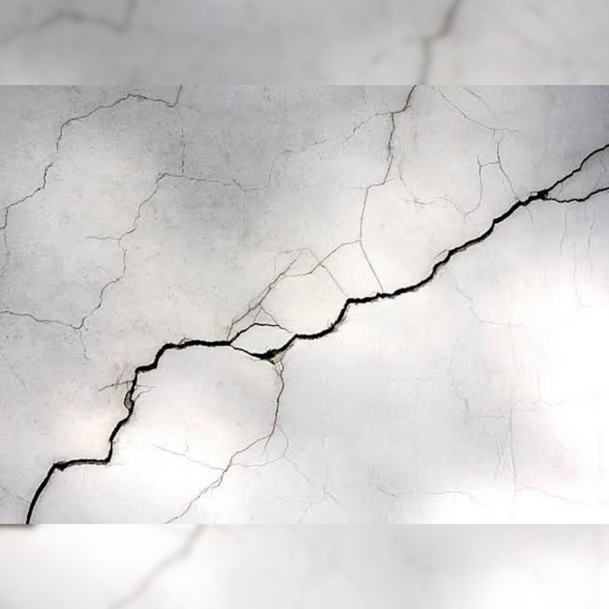
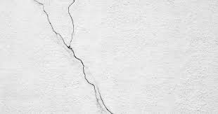
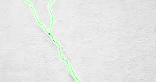

# Crack Segmentation Multi-Model Comparison

This interactive Streamlit web application enables comprehensive comparison between state-of-the-art deep learning architectures for crack detection and segmentation in structural images. The platform supports flexible input methods and provides detailed visual analysis of model performance across different neural network approaches.

## Key Capabilities

- **Flexible Input Options**: Upload individual images, batch process multiple images, or extract and analyze entire image collections from ZIP archives 
- **Advanced Model Ensemble**: Evaluate performance across five cutting-edge segmentation architectures:
    1. **CrackFusionNet**: Custom fusion architecture combining UNet and FPN approaches
    2. **UnetSEResnet50**: U-Net architecture enhanced with Squeeze-and-Excitation ResNet50 encoder
    3. **UnetPlusPlusResNet18**: Advanced U-Net++ framework with ResNet18 backbone
    4. **DeepLabV3+**: Google's DeepLabV3+ with ResNet18 encoder for semantic segmentation
    5. **FPN**: Feature Pyramid Network architecture optimized for multi-scale detection
- **Interactive Visualization**: Browse original images through an intuitive carousel interface 
- **Comprehensive Results Analysis**: View detailed segmentation masks overlaid on original images for each model
- **Intelligent Ranking System**: Models automatically sorted by crack detection sensitivity (total predicted crack pixels)
- **Export Functionality**: Download high-quality segmentation results for further analysis or reporting

